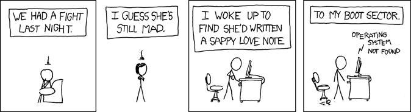

## Introduction



The aim of this course was to furnish linguists with the basic command-line tools necessary to embark upon the computational aspects of their field. Coursework included basic UNIX navigation, installing and running programs from the command line, regular expressions, basic corpus processing, basic bash scripting, version control, remote servers, and troubleshooting when (inevitably) something goes awry. Though all material was posted online, there was an optional in-person session each week during which students could receive guidance from instructors. Coursework consisted of weekly quizzes to check comprehension of the material. The class culminated in a final project, which entailed building the website you're currently viewing and hosting it on GitHub Pages.

## Week 1: The Command Line Environment

During the first week of class, we focused on the fundamentals of navigating a UNIX (or UNIX-like) environment. This included traversing filesystems with `cd` and displaying their contents with `ls`. The concept of using "flags" to increase the power and versatility of commands was also introduced. We also touched on the utility of `>` to redirect output into a less ephemeral form, such as a text file. An example of this can be seen below.

```zsh
echo Hello, World > hello.txt
```
1: basic UNIX command that causes the shell to echo a string and redirect the output into a text file

Below is a non-exhaustive list of the commands introduced in this section, along with notes on their usage and important flags where applicable.

|Command|Function|Notes/Useful Flags|
|---|---|---|
|`pwd`|Prints working directory|Useful for locating oneself in the filesystem|
|`whoami`|Prints username|Ensure one is logged in under the correct account|
|`cd`|Changes directory|Takes a directory as an argument; can be either a relative or absolute path|
|`ls`|Lists directory contents|`-a` includes hidden files; `-l` displays permissions and other helpful info|
|`cat`|Writes the contents of a file (or files) to the shell output|`-n` displays output with line numbers; can be combined with the redirect `>` command to write contents of one file to another|
|`mkdir`|Creates a new directory||
|`cp`|Copies contents of one file to another|Takes the file to copy as the first argument and the destination file as the second; the destination file will be created if it does not already exist|
|`echo`|Writes to output|Often used when writing to text files directly from the terminal|
|`touch`|Updates the timestamp of a file or creates it if it doesn't exist|Commonly used to create new files|
|`rm`|Removes a file|Does not remove directories by default, but the `-r` flag causes it to recursively delete all contents of directory; deleted material is irrecoverable and so this command should be used with caution|
|`rmdir`|Removes a directory|Only works on empty directories and thus is far safer than `rm -r`|


## Week 2: Navigating a UNIX System

In the second week of class, we furthered our exploration of the UNIX environment by learning about file permissions, process management, and remote server access. First, we touched on the various types of permissions available for a given file and how to modify them with the `chmod` command. These permissions consist of:

* Read- Governs whether a user can view the contents of a file
* Write- Governs whether a user can modify the file
* Execute- Governs whether a user can run the file

These permissions in turn can be distributed freely across the following identities:

* Owner (u)- The file's creator
* Group (g)- Users in the same group as Owner
* Other (o)- Users not in Owner's group

The `chmod` command can distribute permissions using either symbolic or octal notation. Both of the following commands have the effect of giving Owner read and write permissions to a file while making it read-only to all others.

Symbolic:
```zsh
chmod u+rw,go+r file_name
```
Octal:
```zsh
chmod 644 file_name
```
2: Symbolic and octal notation for configuring read-write permissions for Owner and read-only permissions for all others 

Next, we learned about managing processes from the command line. In particular, the `ps` command with optional `-f` flag were discussed. This is used to display all processes currently running, which can be subsequently killed using the `kill` command.

Finally, we set up credentials with the University of Helsinki's Puhti server in order to practice remote server access. We used the `ssh` command to log in to the server and `scp` to move files between the server and our local machine. 

## Week 3: Basic Corpus Processing

In the third week, we learned about text encoding and simple regular expressions. To begin, we discussed the various schemes by which binary input is processed into text files. These formats include ASCII and UTF-8 among many, many others. Then, we learned briefly about some of the common commands used to switch between encoding formats, as well as how to set defaults within the shell environment.

From this we transitioned to text file processing itself. In particular, we learned how the `grep` command can be used to locate particular items within an arbitrarily large text file. Combining `grep` with regular expressions allows for extremely precise searching; one can, for example, locate all words that begin with "pre-" and end with "-ed". This becomes especially powerful when combined with common commands for transforming text files into more useable formats; in particular, the `tr` command is a versatile tool which can accomplish everything from whitespace removal to text substitution (especially when using regular expressions). Combining it with the `uniq` command, which filters out and reports all duplicate lines, and the self-explanatory `sort` command, one can efficiently generate frequency lists for words and phrases. This process can be made even more efficient using the 'pipe' character `|`, which routes the output of the operation on its left to the input of the operation on its right. An example operation can be seen below.

```zsh
cat EXAMPLE.txt | tr -d '\r' | tr -s "[:space:]" "\n" | tr -d "[:punct:]" | sort | uniq -i > EXAMPLE.wordlist.txt
```
3: A series of piped commands that transform EXAMPLE.txt into an alphabetically-ordered word list, with each word appearing on its own line and devoid of punctuation. Case is also ignored. The result output is redirected into the file EXAMPLE.wordlist.txt. From left to right, these commands perform the following: open EXAMPLE.txt, remove carriage returns, transform spaces into newlines so that each word has its own line, remove punctuation, sort lines into alphabetical order, delete duplicates (ignoring case), and save to EXAMPLE.wordlist.txt.

## Week 4: Advanced Corpus Processing

In the fourth week, we built upon our knowledge of text processing in order to accomplish even more sophisticated manipulations of text files. The main tool for this was the `sed` command. While `sed` is able to delete entire lines from a file, this is only the beginning. `sed` can also be used to find and replace patterns in a text file, and it becomes especially powerful when combined with the aforementioned regular expressions. By combining regular expression-augmented `sed` commands with command piping from the previous week, we became able to quite quickly transform any text file into a frequency list, a sentence-per-line list, or even a list of n-grams--that is, a list of adjacent words. Below can be seen a series of piped commands that uses `sed` along with commands from the previous week to convert a text file into sentence-per-line format.

```zsh
cat EXAMPLE.txt | sed 's/^$/#/' | tr '\n' ' ' | sed -E 's/([.?!]) ([A-Z])/\#1 \2/g' | tr '#' '\n' | sed 's/^ *//'| sed 's/ *$//' > EXAMPLE.sent
```
4: From left to right: open EXAMPLE.txt, replace all empty lines with '#', convert all newline characters to spaces, insert a '#' character between every punctuation mark and the first word of the following sentence, convert all '#' characters to newline characters, delete all leading spaces on each line, delete all trailing spaces on each line, and save to EXAMPLE.sent

## Week 5: Scripting and Configuration Files

Thusfar, we had developed some exceedingly powerful techniques for text processing by piping a series of commands together to perform sophisticated operations. However, there existed a very significant bottleneck: the same sequence of commands needs to be typed (or pasted) anew into the shell for each new text file to be processed. This week added a new level of sophistication to our methodology by way of scripting. Scripts can pipe commands together, take arguments, obey conditional instructions, and return outputs. Below can be seen a sample bash script.

By writing our text processing commands into text files (the aforementioned 'scripts'), we can automate the text processing command sequence. Then, we can simply run the script from the command line to execute our sequence. Another powerful scripting tool is variable definition, which allows us to set values we can then access later on in our programs. We also explored environment variables, which are values that govern the functionality of the command line interface itself. Shell protocols such as paths for script execution, information displayed in the prompt, and text encoding are all set using environment variables. By modifying environment variables, users can customize and personalize the interface in order to tailor it to their needs. 

```bash
#! /bin/bash

# script: freqlist.sh
# author: Edward Delmonico (September 2024)
#
# Read a text file from the standard input
# and compute a fequency list of all words
# in the text. Print to standard output.

if [ $# -ne 2 ]
then
  echo 'noooo i need two arguments what are you doooooing'
  exit 1
fi

cat $1 |
tr -d '\r' | 
tr -s "[:space:]" "\n" | 
tr -d "[:punct:]" | 
sort | 
uniq -c | 
sort -nr > $2
echo "$0 complete"
```
5: Bash script for transforming a text file into a word frequency list. The user supplies a source text file to be operated on and a destination file to which the results are written. The script first checks to make sure both a source and destination are supplied, then performs the following operations: remove whitespace, convert spaces to newlines, trim punctuation, sort words into alphabetical order, delete duplicate words (while reporting number of duplicates), sort by number of duplicates, and redirect output into destination file.

## Week 6: Installing Programs

In week 6, we embarked upon the dizzying world of package installation and management. This is far less trivial a topic than it might initially appear-- any given program installed from the command line depends on a number of other programs to work, which programs depend on yet others, and so on. Package managers such as brew or pip come to the rescue here. In addition to installing programs, they also install and/or update all of the program's dependencies in order for it to function. Package managers become especially crucial when different programs depend on different *versions* of the same program to work, necessitating the installation of different versions in different directories. Python in particular offers an elegant solution to this problem in the form of *virtual environments*, which enables one to create an environment siloed off from the rest of one's machine in order to freely install and run programs. Generally speaking, we spent quite a while locating programs in various package managers and following the instructions to safely install them.

In addition, we familiarized ourselves with Makefiles. Makefiles add yet another layer of sophistication to scripts, enabling a user to run specific script actions on collections of files. This is accomplished by compiling a list of source files, specifying patterns of conversion, and establishing dependency rules to accomplish these conversions. Below can be seen a Makefile that is able to trim metadata from a list of book text files as well as convert them to sentence-per-line format and generate frequency lists.

```makefile
BOOKS=alice christmas_carol dracula frankenstein heart_of_darkness life_of_bee moby_dick modest_propsal pride_and_prejudice tale_of_two_cities ulysses

FREQLISTS=$(BOOKS:%=results/%.freq.txt)
SENTEDBOOKS=$(BOOKS:%=results/%.sent.txt)
NO_MD_BOOKS=$(BOOKS:%=data/%.no_md.txt)

all: $(FREQLISTS) $(SENTEDBOOKS) $(NO_MD_BOOKS) results/all.freq.txt results/all.sent.txt

clean:
	rm -f results/* data/*no_md.txt

%.no_md.txt: %.txt
	python3 src/remove_gutenberg_metadata.py $< > $@

results/%.freq.txt: data/%.no_md.txt 
	src/freqlist.sh $< > $@

results/%.sent.txt: data/%.no_md.txt
	src/sent_per_line.sh $< > $@

data/all.no_md.txt: $(NO_MD_BOOKS)
	cat $^ > $@
	
no_md: $(NO_MD_BOOKS)
```
6: Makefile for metadata trimming, sentence-per-line formatting, and frequency list generation. The first line specifies the list of books upon which the Makefile operates. The next three lines specify conversion patterns, dictating what list is passed in to the pattern as an input as well as how (and where) the output is written. Below this can be seen the rules themselves, which run scripts on their input files and generate the appropriate output. Each rule can be executed individually, or all at once using the `all` rule. The `clean` rule can also be used to delete all generated files, cutting down on filesize and making the program more portable. 

## Week 7: Version Control

For our final week of instruction, we turned our focus version control. Version control software (such as Git, the tool we used for this course) is essential for large projects with small margins for error. Users establish a repository, or 'repo', essectially a tranche of files that comprise a larger project. Upon initialization, Git creates a record of all files as they exist in their current state. These files are then "tracked", and whenever a tracked file is modified or deleted Git will record the change. Users can then "stage" as many changes as they like and then "commit" these changes. When users commit staged changes, Git updates its record along with a message supplied by the user. This is only the beginning, however. One critical aspect of Git is the ability to "rewind" commits-- users can at any time revert all of their changes to a previous git record, restoring their work to an earlier version. This is especially handy if a Git commit breaks a project or takes it in an undesirable direction. Git also allows users to create "branches", duplicating a project so that additional work can be done on it without compromising the original. This also allows multiple users to collaborate on a project, as each collaborator can develop a different feature in a separate project branch. These branches can then be selectively merged, either with each other or with the original branch. 

Git's power is compounded further by its remote component GitHub. GitHub allows users to store their repositories online. GitHub repositories can then be "cloned" to local machines. Repositories can also be "forked", which creates a new iteration of the repository in one's own collection. This allows a user to do their own work on a repository without ever compromising the original. The "pull" and "push" functionalities also streamline collaboration on the same project. If a collaborator wishes to work on a repository branch, they can send a pull request. This gathers the most up-to-date version of the branch and copies it to the user's local machine. The user can then do whatever work they wish on the branch, committing changes as they go, before pushing the changes back up to the remote repository. The changes are then disseminated to the remote repository. Again, a crucial aspect of Git's usefulness is that nearly any change can be revoked--erroneous commits, pushes, and merges can all be rolled back.

To create this webpage, I used Git in order to track my changes and create branches for major features. In particular, this particular page is being created within a separate branch from the main project. When I add to the page I ensure that I'm working on the appopriate branch (entitled 'cmdline-course'), review my changes, commit them along with a descriptive message, and push those changes to my remote repository on GitHub. Below can be seen the series of commands I will run in order to review, commit, and push the addition of this section to the page.

```zsh
git checkout cmdline-course
git status
git commit -a -m 'add week 7'
git push origin cmdline-course
```
7: Sequence of git commands. The first shifts project focus to the cmdline-course branch. The second displays the repository's status, showing which files have been added or changed. Running the 'commit' command with the `-a` flag stages all changes and commits them in one fell swoop, while the `-m` flag allows a message to be added in the same command. The final command pushes the changes so that the remote GitHub repository is updated to reflect the changes made locally.