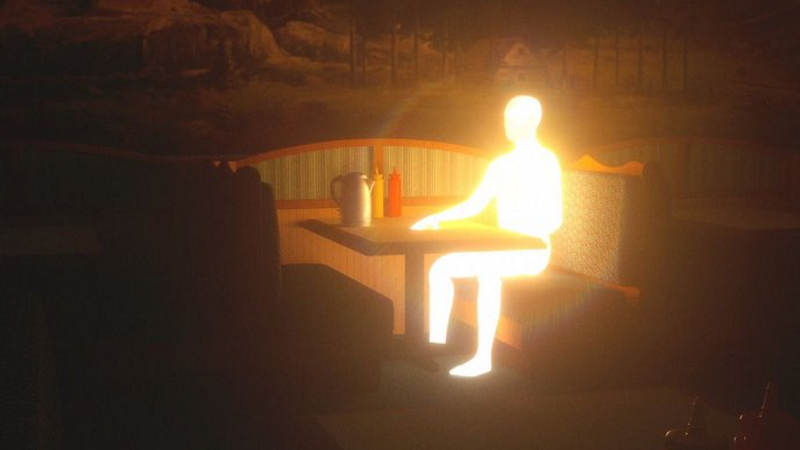

## Introduction

Edward Delmonico is a master's student at the University of Helsinki. He is studying General Linguistics and completing an additional module in Language Technology. He is originally from Phoenix, Arizona, and will never again of his own volition live somewhere that hot. Finland's cold, gloomy weather suits him just fine.

In his spare time he enjoys reading, cooking, hiking, and games of all varieties. Completing the New York Times Saturday crossword in under ten minutes stands among his proudest achievements. He also loves cats, and is casting about for even the slimmest excuse to adopt one.
## Find him on

[GitHub](https://github.com/EdwardDelmonico)---[LinkedIn](https://www.linkedin.com/in/edward-delmonico-841685a4/)---[Goodreads](https://www.goodreads.com/user/show/59718929-edward)---[Letterboxd](https://letterboxd.com/WelcomedAndroid/)

## Correspond

Edward can be reached at edward.delmonico@helsinki.fi. 

## Coursework

[Command-Line Tools for Linguists](https://studies.helsinki.fi/courses/course-implementation/hy-opt-cur-2425-261401a1-c550-4436-91b9-7edf4a1a3b57/KIK-LG221), fall 2024

[Field Methods: Language description and documentation](https://studies.helsinki.fi/courses/course-implementation/hy-opt-cur-2425-0cbb79a6-9368-45e9-8b15-9b1bda7cebce/LDA-L315), fall 2024

[Historical Linguistics](https://studies.helsinki.fi/courses/course-implementation/hy-opt-cur-2425-d7f9cac2-6b3c-4472-87cb-6289b56b7f80/LDA-L312), fall 2024

[Introduction to Linguistic Diversity and Digital Humanities](https://studies.helsinki.fi/courses/course-implementation/hy-opt-cur-2425-9df97501-21e6-4b8d-9de4-e91303f2ff71/LDA-301), fall 2024

## Projects

[The Demiurge](https://github.com/EdwardDelmonico/demiurge)- Discord bot that rolls dice, draws cards, and divines the future for games of Invisible Sun

[CSC205Final](https://github.com/EdwardDelmonico/CSC205Final)- Activity suite created for Data Structures & Object-Oriented Programming course

[This very web page](https://github.com/EdwardDelmonico/EdwardDelmonico.github.io)- Final project for Command Line course

## Misc. 